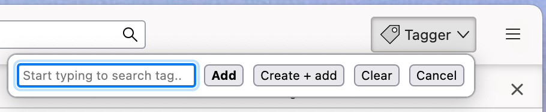

# Tagger

A Thunderbird extension to quickly tag selected messages using autocompletion.

(c) Jaap-Henk Hoepman (info@xot.nl)

Released under the [MIT](https://opensource.org/licenses/MIT) license. 

## Description

Tagger is a Thunderbird extension that allows you to quickly tag selected messages from a large list of existing tags using autocompletion. It also allows you to create and add new tags, or clear all currently set tags, on selected messages.

## Interface

Tagger installs a 'Tagger' button on Thunderbird's toolbar that opens a popup when clicked (or when pressing Ctrl-T on Windows or Command-T on Macos).



The popup contains a text input field to enter a tag string. While typing, a drop down list of all tags matching this string appears. The tag can be selected from this list by clicking with the mouse, or pressing the arrow down key repeatedly to select one and pressing the right arrow to complete it in the text input field (unfortunately without any visual feedback at the moment, see limitations below). Pressing the RETURN key adds the selected tag to the selected messages.

The four buttons in the popup perform the following functions:

- Add: adds an existing tag to the selected messages. Does nothing if the tag string currently entered does not exist. Pressing RETURN is the same as pressing the Add button.
- Create + add: creates a new tag and adds it to the selected messages. Does nothing if the tag string currently entered already exists.
- Clear: removes all tags from the selected messages.
- Close: closes the popup and does nothing. Pressing ESC or clicking outside the popup does the same.

## Installation

Download ```tagger.xpi``` from this repository, and use Thundebird's Add-ons Manager to install the extension from this downloaded file.

## Motivation

Tagger is especially useful for people that use a lot of tags to organise their emails, instead of using topic based folders. Instead of having to decide which folder an email should be archived in (perhaps sometimes even copying emails to several folders to be sure), one can easily add different tags to an email, and use the standard Thunderbird archiving method to archive them for later. 

It is worth noting that Thunderbird typically stores the tags assigned to an email with the email itself using the X-Mozilla-Keys header, except for mails that arrive over IMAP (and that are later archived). To *ensure* the tags are stored with the emails themselves in the archive folder, note that compacting a folder will store tag information within the emails in the folder. Unfortunately, Thunderbird ignores a compact command for folders to which only messages have been added since the last compact command. To *force* compacting a folder, therefore first add a dummy messages to it, and immediately delete it, before requesting the compact operation.


## Limitations

- The drop down list (for some reason) only shows at most 19 matching options. If you have many tags, the list truncated. Start typing part of the tag and soon the number of possible matches is small enough to shown them all.

- When selecting an option from the drop down list, the currently selected or hovered option is not highlighted, so it is hard to see what you select. This appears to be a bug in Thunderbird for which a [report has been filed](https://bugzilla.mozilla.org/show_bug.cgi?id=1844911).

- Internally, tags are represented (and stored as) keys. When created through the 'Manage tags...' interface or 'New tag...' pop-up, these keys use underscores (_) to replace spaces, allow hyphens (-) in tags, and use &xxx- notation to represent non-ASCII characters. Unfortunately, the current Thunderbird API does not allow creating such keys for new tags, meaning that
  the keys created for such complex tags using tagger are not portable to other installations of Thunderbird using the same tags (but created through the 'official' user interface). This is an issue when migrating mail folders (that store tag keys with the actual mails using the X-Mozilla-Keys header).
  A [bug report has been filed](https://bugzilla.mozilla.org/show_bug.cgi?id=1844747).
  
